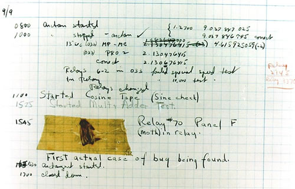

# Debugging Lecture 1

Nobody writes programs that are correct the first time around. Today we'll learn
about debugging: the act of finding and fixing problems in your code. In your
career as a programmer you'll discover and fix many problems and you'll debug
code by other programmers. Learning how to debug a program is an essential skill
for any programmer.

These problems are generally referred to as bugs, but why do we call them bugs?
Well, the reason is probably because Grace Hopper, one of the famous and one of
the first programmers, frequently recounted a story where in 1945 a real moth was
found in one of the computers. The people who found the moth kept the insect and
added it to the logbook with the subtext: "First actual case of bug being
found." The term stuck around and we still use it today to refer to problems in
code.



*"First actual case of bug being found"* :joy:

## Becoming Sherlock Holmes

Take off your programmer hats and put on your Sherlock hat cause we're going to
treat our code as a crime scene.

Let's say someone was murdered and Sherlock Holmes was called to solve the
murder. Holmes enters the crime scene and will first look at the victim to see
what happened. Quite quickly though he will start looking for objects that might
have been used to commit this crime, and the objects that were used to prepare
it. From this evidence he will try to imagine what exactly happened. This
process is called deduction, taking one thing and thinking about what it
logically implies: if a gun was found near the crime scene and a bullet of the
gun was found on the victim we can logically conclude the gun was the murder
weapon.

We're gonna do exactly the same! Except we're not gonna murder anyone and our
crime scene is not in the real world but in the virtual world of code.

## Hello wordl

Let's look at this program. It has a bug in it:

```js
// This program should log `hackyourfuture`

let elements = ["hack", "your", "future"];
let result = "";
for (let index = 0; index <= elements.length; index++) {
    result += elements[index];
}
console.log(result);
```

## Reading failures

Debugging always starts by reading either some failure message or look at
something you didn't expect. Now, what a lot of people do is throw their hands
in the air and say: "aahhhh, it's not working!". Don't do that. Something is not
working, you don't know what, but you're gonna find out. Most likely most of
your code is perfectly fine, but you just made a mistake somewhere. Reading the
error is the absolute first step and the first clue to where your bug might
be hiding.

Let's run our program to see what it does:

```js
console.log(result); // the observable failure: `hackyourfutureundefined`
```

Quite simply we expect `hackyourfuture` to be logged but instead we got
`hackyourfutureundefined`. This is our failure, now we need start looking
at where the code is that caused this problem.

## Inspecting state

A bug will always result in unexpected program state. Remember that the program
state (or state) consists of all the variables and their contents. 

**Question:** What state should we log and where do we put the `console.log` lines?

To find the bug we first need to look at the state to see what's off. To do this
we add a `console.log` line to our code where we let the program write down our
state every time we do a lookup in the `elements` array.

```js
result += elements[index];
console.log("index: " + index + " element: " + elements[i] + " result: " + result);
```

After we run the program the output of our `console.log` looks like this:

```js
index i: 0 element: hack result: hack
index i: 1 element: your result: hackyour
index i: 2 element: future result: hackyourfuture
index i: 3 element: undefined result: hackyourfutureundefined
hackyourfutureundefined
```

We see that at index `3` when we do a lookup in our `elements` array. The
element isn't there and javascript gives us the `undefined` value instead. 
If we know that `index` has the wrong value we can look at the code that 
affects `index`.

**Question:** What other state got affected by our bug?

Because we add `undefined` (through `result += elements[index]`) to `result`,
the `result` variable is now affected as well.

## Finding and fixing a bug

Ofcourse our `for` loop is the code messing with the `index` and we can easily
see the condition is wrong and should be `index < elements.length` instead.

```js
for (let index = 0; index <= elements.length; index++)
```

With this simple example you can see that even though the code is small and the
bug is quite obvious there's a difference from where we observe a failure in our
program and the code that caused it. It's important to always remember this,
with more complex bugs there's often a bigger distance (in code) between the
code that caused the failure and the code that has a bug in it. The code that
caused the failure can often be perfectly fine, but the code that has a bug
never is.

*Background: These types of bugs are called off-by-one bugs and are in fact
quite common. In our first buggy program we were expecting the value `3` to
correspond with the 3rd element in the array, but arrays in javascript start
counting at `0`. The 3rd element corresponds to the `index` variable being equal
to `2`.*

**Question:** if there has never been a failure in your program does that mean
that there are no bugs in it? Motivate your answer.

## Summary

We covered a lot of ground in this lecture, introducing many new concepts. To
summarize:

1. You learned that bugs are part of a programmer's life.
2. You learned that a bug can cause a failure in your program.
3. You learned how to use `console.log` to look at the program state to find the bug.
4. But most of all: don't panic! :)
